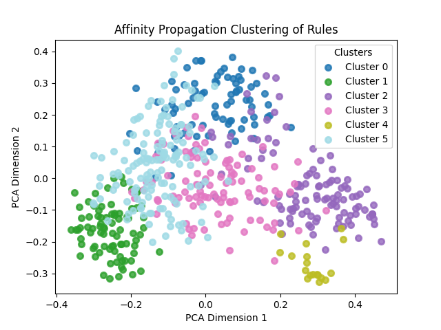

1. Ask questions through gpt, convert each rule code into natural language, and remove specific variable names or function names
prompt：Use 1-2 sentences to tell me what this rule/invariant needs to be verified. Do not involve specific function names or contract names.
[rule_classification1.csv](assets/rule_classification1.csv)

2. Use openai’s text-embedding-003, 3072 dimensions to construct a pairwise N*N similarity matrix after vectorization.
3. Use AffinityPropagation for classification
params：AffinityPropagation(damping=0.5, preference=-75, random_state=5)

Classification results (6 categories in total):
Here's the data from the image you provided organized into a table format:

| Cluster | 1st Keyword      | 2nd Keyword      | 3rd Keyword      | 4th Keyword      | 5th Keyword      | 6th Keyword      | 7th Keyword      | 8th Keyword      | 9th Keyword      | 10th Keyword     |
|---------|------------------|------------------|------------------|------------------|------------------|------------------|------------------|------------------|------------------|------------------|
| 0       | rule (5.60)      | needs (5.57)     | collateral (5.06)| reserve (4.52)   | verified (4.43)  | ensure (4.38)    | asset (4.15)     | borrowing (4.00) | value (3.98)     | assets (3.97)    |
| 1       | address (8.82)   | tokens (8.65)    | balance (8.36)   | token (7.79)     | rule (7.72)      | needs (7.03)     | specific (6.53)  | verified (5.84)  | ensure (5.73)    | minting (5.64)   |
| 2       | rule (8.16)      | needs (6.81)     | specific (5.89)  | set (5.77)       | verifies (5.40)  | verified (5.31)  | ensure (5.05)    | action (4.88)    | state (4.73)     | certain (4.69)   |
| 3       | rule (7.19)      | verifies (5.76)  | user (5.61)      | needs (5.48)     | function (5.07)  | contract (4.26)  | specific (4.26)  | ensure (3.96)    | balance (3.95)   | functions (3.87) |
| 4       | proposal (4.40)  | user (4.24)      | upvote (3.92)    | rule (2.68)      | upvotes (1.90)   | verifies (1.82)  | invariant (1.75) | ensures (1.66)   | ensuring (1.50)  | upvoted (1.36)   |
| 5       | balance (10.91)  | rule (10.80)     | needs (9.76)     | user (8.53)      | verified (8.32)  | ensure (8.32)    | total (7.54)     | verifies (7.38)  | specific (6.83)  | remains (6.44)   |

This table categorizes keywords into different clusters based on their relevance and frequency, providing a structured way to analyze the data. Let me know if there's anything specific you need from this data!

Use TF-IDF and textrank to extract keywords and key sentences
4. Extract the results:
[processed_cluster.csv](assets/processed_cluster.csv)

5. Differences in key sentences:
1. Cluster 0 mainly involves the correct use of assets and risk control in financial transactions. For example, ensuring that liquidity pool rules are followed and verifying that assets are valued and used correctly when used as collateral or for borrowing.
2. Cluster 1 focuses on integrity verification of token supply and token balances. The focus is on ensuring that the total supply of tokens is equal to the token balances of individual accounts, as well as the rules for managing token balances for specific addresses.
3. Cluster 2 focuses on consistency verification of specific value conversions and status queues. For example, verifying correct conversion of values in different bases, and maintaining state consistency within a specific action queue.
4. Cluster 3 involves user interaction and correct execution of contract functions. This includes verifying operations such as token transfers and voting rights delegation changes to ensure that these functions work properly under specific conditions.
5. Cluster 4 mainly focuses on the verification of proposal voting rules. For example, ensuring that users cannot vote for the same proposal twice and that the total number of votes is consistent.
6. Cluster 5 focuses on the verification of user balances and overall system balances, especially the correctness of liability and mortgage calculations in financial systems (such as vault systems).
1. Cluster 0:
Top 5 TF-IDF Keywords: [('rule', 5.602977437096004), ('needs', 5.566963736250369), ('collateral', 5.056974674453186), ('reserve', 4.516760979389803), ('verified', 4.434737445254291), ('ensure', 4.376407011718142), ('asset', 4.148503387345741), ('borrowing', 3.9961536114141403), ('value', 3.9809929442086807), ('assets', 3.966288825718195)]
Luhn Summary:
This rule needs to be verified by ensuring that the liquidity of the pool is equal to zero if and only if either the total supply is equal to zero or the balance of the pool minus the amount owed by the pool is equal to zero for both tokens. This rule/invariant needs to be verified to ensure that the oracle rate is calculated as a linear interpolation between two on-chain rates, and that the present value of a shorter-dated asset is always less than the present value of a longer-dated asset for any given asset and oracle rate. This rule/invariant needs to be verified to ensure the correct usage of assets as collateral or for borrowing in the system, as well as to maintain the integrity of the isolation mode state where only one asset can act as collateral and siloed borrowing state where only one asset can be borrowed.

Cluster 1:
Top 5 TF-IDF Keywords: [('address', 8.820943400928583), ('tokens', 8.64848445946444), ('balance', 8.360666634461351), ('token', 7.78720888926403), ('rule', 7.71577913211353), ('needs', 7.031833711899822), ('specific', 6.534143258738864), ('verified', 5.84157611354677), ('ensure', 5.732500732643548), ('minting', 5.643423043537424)]
Luhn Summary:
This rule verifies the integrity of the total token supply by ensuring that it is always greater than or equal to the sum of rebasing and non-rebasing credits per token, taking into account any changes in the non-rebasing status of accounts. This rule/invariant needs to be verified to ensure that the total supply of a token is equal to the sum of all individual token balances, and that the balance of the zero address for a token is always zero. This rule verifies the integrity of updating the distribution of discount tokens between sender and recipient addresses, ensuring that the sender's balance decreases by the specified amount and the recipient's balance increases by the same amount, while also checking that the discount rate does not exceed 100%.

Cluster 2:
Top 5 TF-IDF Keywords: [('rule', 8.161224591569383), ('needs', 6.810314280223165), ('specific', 5.891392660866735), ('set', 5.766882696057091), ('verifies', 5.402670965425173), ('verified', 5.313608860451873), ('ensure', 5.0533514567221465), ('action', 4.884641089863077), ('state', 4.732610494593696), ('certain', 4.6915719327419545)]
Luhn Summary:
This rule needs to be verified to ensure that converting a smaller input value to a specified base results in a value that is less than or equal to the conversion of a larger input value to the same base. This rule verifies that converting an amount from base to elastic and back to base, as well as converting an amount from elastic to base and back to elastic, results in the original amount when the base value is 0, considering the specified rounding behavior. This rule verifies that the queued state consistency of a certain action set is maintained by ensuring that the action has not been canceled or executed and that the current state is set to 0 after processing the message from the root.

Cluster 3:
Top 5 TF-IDF Keywords: [('rule', 7.190615665904435), ('verifies', 5.762966205742568), ('user', 5.610327846789344), ('needs', 5.481486996514362), ('function', 5.072957629585387), ('contract', 4.263512142788777), ('specific', 4.260392457419211), ('ensure', 3.958482548572939), ('balance', 3.949445695060997), ('functions', 3.8718235667149203)]
Luhn Summary:
This rule needs to verify that the correct amount of tokens are transferred from the current contract to the receiver instance after an exit function is called, while ensuring that the strategy balance before the exit is less than the balance after the transfer. This rule ensures that the total supply of tokens remains consistent and does not revert during the execution of certain functions by checking that it is always greater than or equal to a calculated value based on rebasing and non-rebasing credits per token. This rule needs to be verified to ensure that when a delegator delegates their votes to a new delegatee, the delegatee receives the correct number of votes, the previous delegatee loses their delegated votes, and the total number of votes remains consistent.

Cluster 4:
Top 5 TF-IDF Keywords: [('proposal', 4.399852539821301), ('user', 4.237387146312701), ('upvote', 3.920014384465296), ('rule', 2.6807862114556715), ('upvotes', 1.9002414734749233), ('verifies', 1.8207478373881423), ('invariant', 1.7521732502065015), ('ensures', 1.6584489685763357), ('ensuring', 1.502130351786666), ('upvoted', 1.3570387922482985)]
Luhn Summary:
This rule verifies that a user cannot upvote the same proposal more than once, ensuring that the number of upvotes on a proposal only increases when a user who has not previously upvoted it does so. This rule/invariant ensures that a user can only upvote a proposal once and that the total number of upvotes for a proposal remains consistent when a user who has already upvoted the proposal tries to upvote it again. This rule/invariant needs to be verified to ensure that a user cannot upvote a proposal multiple times, and that the total upvotes for a proposal do not increase when the same user upvotes it again.

Cluster 5:
Top 5 TF-IDF Keywords: [('balance', 10.909231473669385), ('rule', 10.800723406699879), ('needs', 9.757795720400757), ('user', 8.530310587587719), ('verified', 8.320373879677451), ('ensure', 8.31623230922205), ('total', 7.539330503233643), ('verifies', 7.375370100330704), ('specific', 6.826734740438978), ('remains', 6.438875495435254)]
Luhn Summary:
This rule/invariant needs to be verified to ensure that the collateral and debt calculation in the vault system is correct and that the changes in vault balances and system balances are coherent and consistent in different cases of valid vault configurations. This rule verifies that the total supply of a specific token and the balance of a specific token in a pool remain unchanged after settling a vault, while ensuring that the amount removed from the vault matches the balance change in the pool. This rule needs to verify that the total supply of a token, the total supply of the underlying asset, and the balance of the underlying asset held by a contract are updated correctly when a deposit is made for a specific account.